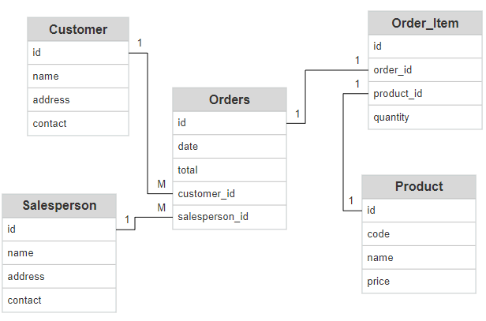

# Introduction
The JDBC portion of the core Java project is meant as practice for using Java Database 
connectivity. It revolves around a psql database that contains various tables and the
Java code is used to CRUD that data. The code is all written in Java, docker is used to provision
a psql instance, and git was used for version control. 

# Implementation
The program uses the class DatabaseConnectionManager to connect to the psql instance. 
The CustomerDAO class is used for CRUD operations on the Customer table. And the JDBCExecutor 
contains the main class that can be used for various SQL operations. 
## ER Diagram

## Design Patterns
The project implements the DAO pattern to perform CRUD operations against a psql database. 
This pattern involves using an abstract api to simplify these operations. Another pattern
that could potentially have been used is the repository pattern. However, since the project only involves dealing with 
the customer table it was not necessary.

# Test
Tests were done manually by executing various CRUD operations via the DAO and running SELECT commands on the 
database to ensure the operations were successful.