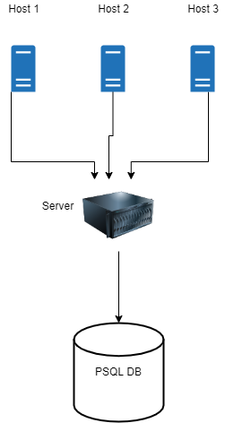

                            PSQL/LINUX PROJECT

##**Intro:** 
This project is used to get the hardware info and server usage info of a user and write that data into a psql database. 
The user does not need to set up anything manually as the scripts provided will do all the heavy lifting. 
The scripts are written in BASH and psql is used within a docker container so no real modifications are necessary 
to the user's environment.

##**Quick start:**
To start using the project, first run the scripts psql_docker.sh using the following command: `./psql_docker create your_desired_username you_desired_password`
inside the project directory. This will provision and start a psql container. 

Next use the command: `psql -h localhost -U postgres -d host_agent -f sql/ddl.sql`.
This will create the required tables inside the psql instance. 

Once the psql instance is set up. It is time to use the host_info.sh and host_usage.sh scripts.
To run host_info simply type `./host_info.sh localhost 5432 host_agent postgres password`.
This will gather the user's hardware info and insert it into the host_info table.

The host_usage.sh script requires the same arguments.
However, we must first set up crontab as we need to constantly monitor the usage data. First use the command crontab -e.
This will bring you to a new script editor. Inside the editor type: `* * * * * "absolute path of script along with same arguments as host_info"`.

##**Implementation:** 
This project was created by first writing the commands to find the user
hardware and usage info then creating an adequate psql instance and writing the commands necessary
to insert the data into the psql database.

##**Architecture:**

##**Scripts:**

**scripts/psql_docker.sh:** 
This script is used to provision a psql docker container. 
The script has a cmd argument  with 3 options(create, start, stop). 
When using the create option user must add username and password arguments for
their psql user. Start and stop are used to start or stop the container once is has been created.

**sql/ddl.sql:** This sql file is used to create the two tables used to store the user's hardware and usage info. These
tables must be provisioned before the other scripts can be executed.

**scripts/host_info.sh:** Script used to find specific user hardware information(cpu architecture, total memory of root drive, etc.).
It then inserts that data into the specified database inside the host_info table. 
The script takes 5 arguments: host, port number, database name,
psql username, psql password. 

**scripts/host_usage.sh:** Similar to the host_info.sh script this script is used to find the user's server usage
info and insert it into the specified database inside the host_usage table.
It takes the same arguments as host_info.sh. However,
this information needs to be constantly updated so crontab must be used to run host_usage.sh every minute.

##**Database Modeling:**
    
**host_info Table**

| id | hostname                    | cpu_number | cpu_architecture | cpu_model     | cpu_mhz    | L2_cache | total_mem | timestamp           |
|----|-----------------------------|------------|------------------|---------------|------------|----------|-----------|---------------------|
| 1  | jrvs-remote-desktop-centos7 | 2          | x86_64           | AMD EPYC 7B12 | 2250.00000 | 512      | 8005740   | 2022-10-02 17:28:59 |

**host_usage Table**

| timestamp           | host_id | memory_free | cpu_idle | cpu_kernel | disk_io | disk_available |
|---------------------|---------|-------------|----------|------------|---------|----------------|
| 2022-10-02 20:13:56 | 1       | 3301        | 97       | 0          | 0       | 23142          |

##**Testing:**
All scripts and SQL were tested manually. Once any issues were resolved and the scripts gave the expected results
the were deemed ready for use.

##**Deployment:**
This project is hosted on Github. No further deployment planned as of the writing of this README.

##**Improvements:**
There are some gaps in the project that the scripts do not cover. Such as how to log into the
PSQL instance should the need arise. Also, SQL scripts should be revised down the line if a better option becomes available.

